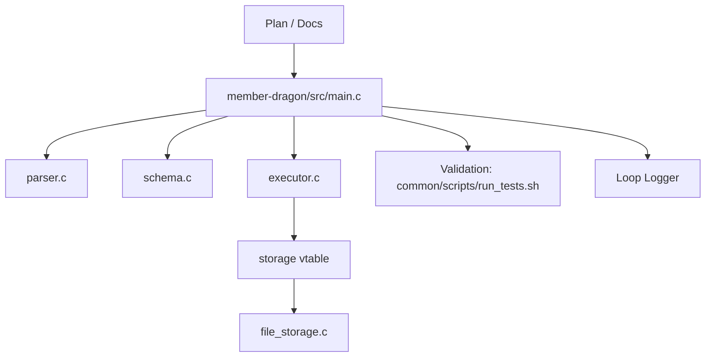

# Harness Architecture

이 하네스는 `mini-sql-parser`의 SQL 처리기 구현을 문서, 실행 루프, 검증, 로그로 묶습니다.

## 상위 원칙

- `common/`은 기준 자산이고 수정하지 않는다.
- 구현 본체는 `member-dragon/src/`다.
- 프로젝트 차이는 문서와 설정으로 분리한다.
- 로그는 재시작과 회고를 위한 실행 기록이다.
- 검증 기준은 `common/scripts/run_tests.sh`로 통일한다.

## 권장 레이어

## 프로젝트 적용점

- SQL 범위는 `INSERT`, `SELECT`, `DELETE`, `UPDATE`다.
- `SELECT`는 단일 `WHERE`, 단일 `ORDER BY`, `LIMIT`를 지원한다.
- 스키마는 현재 작업 디렉토리의 `.schema` 파일에서 읽는다.
- 데이터는 현재 작업 디렉토리의 `<table>.data` 파일에 저장하고 읽는다.
- 에러는 exact string으로만 출력한다.
- 하네스 문서는 구현 전제와 검증 방법을 고정한다.
