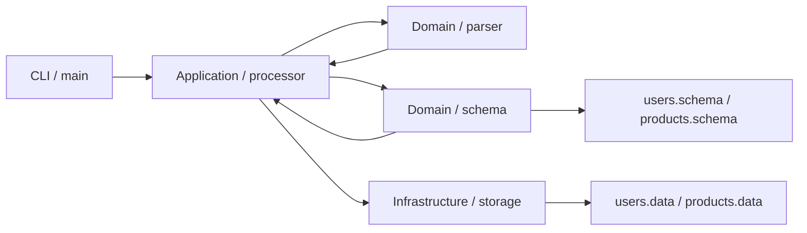

# SQL 처리기

파일 기반으로 동작하는 작은 SQL 처리기입니다.  
입력 SQL 파일을 읽어서 `INSERT`, `SELECT`를 실행하고, 결과를 파일에 저장하거나 조회합니다.

## 목표

이 프로젝트의 목표는 SQL 문장을 읽고, 파싱하고, 실행하고, 파일에 저장하는 전체 흐름을 직접 구현하는 것입니다.  
이번 구현에서는 공개 테스트 정합성과 설명 가능성을 우선해, 범위를 명확히 제한하고 구조를 모듈화했습니다.

## 지원 범위

1. `INSERT INTO ... VALUES (...)`
2. `SELECT * FROM ...`
3. `SELECT col1, col2 FROM ...`
4. 키워드 대소문자 비구분
5. 에러 발생 후 다음 SQL 계속 실행

구현하지 않은 범위입니다.
1. `CREATE TABLE`
2. `WHERE`
3. `UPDATE`, `DELETE`
4. JOIN, 정렬, 집계

## 실행 방법

```bash
cd member-jiun/src
make
./sql_processor input.sql
```

## 예시

```sql
INSERT INTO users (name, age, major) VALUES ('김민준', 25, '컴퓨터공학');
INSERT INTO users (name, age, major) VALUES ('이서연', 22, '경영학');
SELECT name, major FROM users;
```

출력 예시입니다.

```text
name,major
김민준,컴퓨터공학
이서연,경영학
```

## 설계 요약

현재 구현은 클린 아키텍처 형태로 나누어져 있습니다.

1. `interfaces`
: CLI 입력과 진입점을 담당합니다.

2. `application`
: 전체 실행 흐름과 종료코드 집계를 담당합니다.

3. `domain`
: SQL 파싱, 스키마 검증, 규칙 처리를 담당합니다.

4. `infrastructure`
: 파일 읽기/쓰기와 데이터 저장을 담당합니다.

5. `shared`
: 문자열 처리, 벡터, 에러 출력 등 공통 유틸을 담당합니다.

## 아키텍처 그림



## 데이터 저장 방식

각 테이블은 `<table>.data` 파일로 관리합니다.  
내부적으로는 탭 구분 기반의 커스텀 텍스트 포맷을 사용하고, 특수문자는 이스케이프해서 저장합니다.

이 방식을 선택한 이유입니다.
1. 구현이 단순합니다.
2. 디버깅이 쉽습니다.
3. 현재 과제 범위에 맞는 복잡도로 유지할 수 있습니다.

## 보장 범위

현재 버전이 보장하는 범위입니다.

1. `INSERT`, `SELECT`를 요구사항에 맞게 파싱하고 실행합니다.
2. 스키마가 존재하는 테이블과 컬럼만 접근하도록 검증합니다.
3. 잘못된 쿼리에 대해 정해진 에러 메시지를 출력합니다.
4. 한 문장에서 에러가 발생해도 다음 SQL 문장을 계속 실행합니다.
5. 단일 프로세스 기준으로 파일 기반 데이터가 누적 반영됩니다.
6. 단위 테스트, 기능 테스트, 공개 테스트 기준으로 동작을 검증합니다.

현재 버전이 보장하지 않는 범위입니다.

1. 동시 쓰기 충돌 제어
2. 트랜잭션 rollback
3. 전원 장애 이후 durability 보장
4. 백업 및 시점 복구
5. 중복 쓰기 탐지
6. 권한 관리, 암호화, 마스킹, 감사 로그

즉, 현재 구현은 운영용 DBMS가 아니라 과제 요구사항에 맞춘 파일 기반 SQL 처리기입니다.  
동시성, 복구, 보안은 이후 저장소 계층을 교체하거나 확장해서 발전시킬 수 있도록 구조를 나누는 데 집중했습니다.

## 테스트

### 단위 테스트

```bash
./member-jiun/tests/unit/run_unit_tests.sh
```

### 기능 테스트

```bash
./member-jiun/tests/cli/run_cli_tests.sh ./member-jiun/src/sql_processor
./member-jiun/tests/init/run_init_tests.sh ./member-jiun/src/sql_processor
./member-jiun/tests/input/run_input_tests.sh ./member-jiun/src/sql_processor
./member-jiun/tests/parse/run_parse_tests.sh ./member-jiun/src/sql_processor
./member-jiun/tests/insert/run_insert_tests.sh ./member-jiun/src/sql_processor
./member-jiun/tests/select/run_select_tests.sh ./member-jiun/src/sql_processor
./member-jiun/tests/exit/run_exit_tests.sh ./member-jiun/src/sql_processor
```

### 공개 테스트

```bash
./common/scripts/run_tests.sh ./member-jiun/src/sql_processor public
```

## 테스트 결과 요약

| 구분 | 내용 | 현재 상태 |
|---|---|---|
| 단위 테스트 | 파서 및 공통 헬퍼 함수 검증 | 완료 |
| 기능 테스트 | CLI / 초기화 / 입력 / 파싱 / INSERT / SELECT / 종료 처리 | 완료 |
| 공개 테스트 | `common public` 기준 검증 | 통과 |
| 히든 테스트 | 현재 사용자 요청 기준 미실행 | 제외 |

## 검증 포인트

이번 구현에서 특히 신경 쓴 부분입니다.

1. 입력 파일/인자 예외 처리
2. 빈 줄, 공백, 멀티라인, 마지막 세미콜론 누락 처리
3. 문자열 내부 쉼표/세미콜론 보존
4. 에러 발생 후 다음 문장 계속 실행
5. 종료코드 집계 정확성

## 문서

추가 문서입니다.

1. [설계 판단 기록](/Users/nako/jungle/wed_coding_session/jungle-week6-coding-session/member-jiun/decisions.md)
2. [AI 활용 이력](/Users/nako/jungle/wed_coding_session/jungle-week6-coding-session/member-jiun/prompts.md)
3. [서비스 흐름](/Users/nako/jungle/wed_coding_session/jungle-week6-coding-session/member-jiun/docs/flow.md)
4. [코드 실행 흐름](/Users/nako/jungle/wed_coding_session/jungle-week6-coding-session/member-jiun/docs/code-flow.md)
5. [함수 흐름 요약](/Users/nako/jungle/wed_coding_session/jungle-week6-coding-session/member-jiun/src/function-flow.md)
6. [체크리스트](/Users/nako/jungle/wed_coding_session/jungle-week6-coding-session/member-jiun/docs/checklist.md)
7. [구두 질문 정리](/Users/nako/jungle/wed_coding_session/jungle-week6-coding-session/member-jiun/docs/oral-qa.md)

## 한계와 다음 확장

현재 한계입니다.

1. 동시 쓰기 충돌 제어가 없습니다.
2. 트랜잭션 rollback과 장애 복구가 없습니다.
3. 권한 관리, 암호화, 감사 로그가 없습니다.
4. 지원 SQL 범위가 `INSERT`, `SELECT`에 한정됩니다.

다음 확장 방향입니다.

1. `WHERE` 절 추가
2. `UPDATE`, `DELETE` 지원
3. 저장소 계층을 SQLite로 교체하거나 병행 지원
4. 락, 로그, 복구 전략 등 운영 관점 보강
