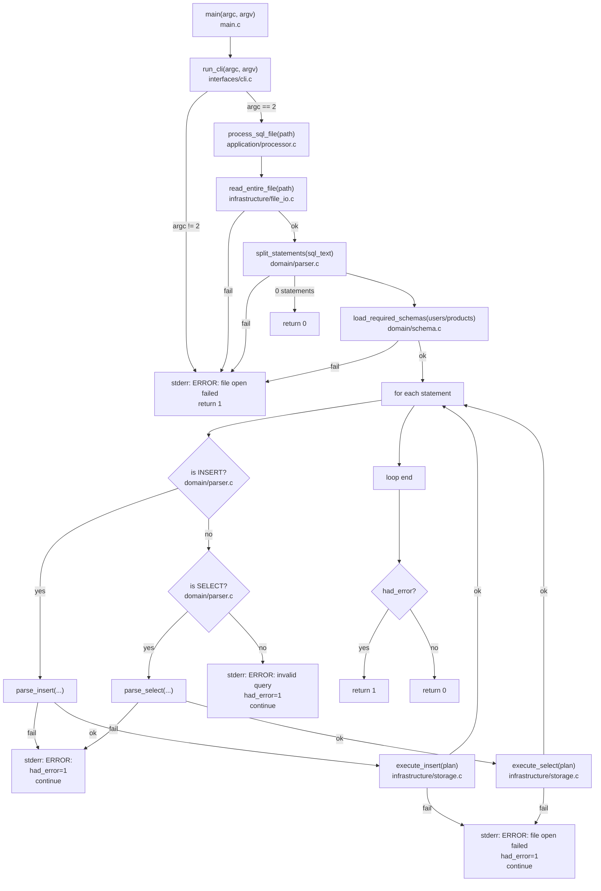

# 코드 실행 흐름 (검증용)

이 문서는 현재 구현 기준의 실제 실행 흐름을 코드 파일 단위로 정리합니다.

## 전체 흐름

## 레이어별 책임
1. `interfaces`: CLI 인자 검증과 진입점 제어를 담당합니다.
2. `application`: 전체 실행 오케스트레이션과 종료코드 집계를 담당합니다.
3. `domain`: 스키마 조회 규칙, SQL 파싱/검증 규칙을 담당합니다.
4. `infrastructure`: 파일 입출력과 저장소 실행(INSERT/SELECT)을 담당합니다.
5. `shared`: 공통 문자열/벡터/에러 유틸을 제공합니다.

## 검증 포인트
1. 입력 파일 열기 실패 시 즉시 `file open failed`가 출력되는지 확인합니다.
2. 문장 파싱 에러가 발생해도 다음 문장을 계속 실행하는지 확인합니다.
3. `INSERT` 성공 시 출력이 없는지 확인합니다.
4. `SELECT` 결과 0건이면 출력이 없는지 확인합니다.
5. 전체 에러 발생 여부에 따라 종료코드가 `0/1`로 정확히 나뉘는지 확인합니다.
